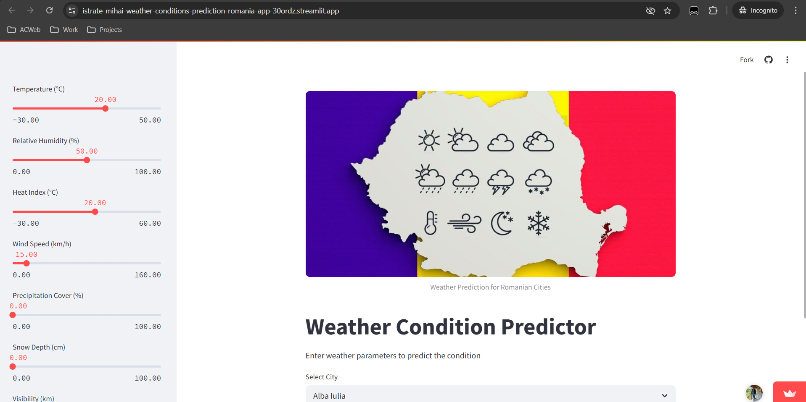

# Project Title: Weather Conditions Prediction Romania

This project is a machine learning classification of weather type accross Romanian counties, using KNN model
algorithm from data registered in weather stations across Romania during the years: 2011 - 2021.

## Project Cover:

## Project Link: [Weather-Conditions-Prediction-Romania](https://istrate-mihai-weather-conditions-prediction-romania-app-30ordz.streamlit.app/)
